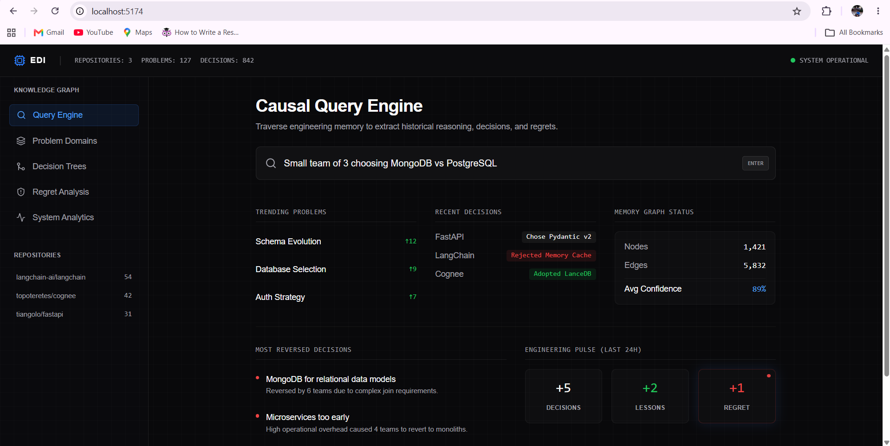
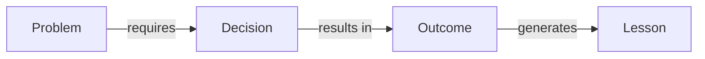
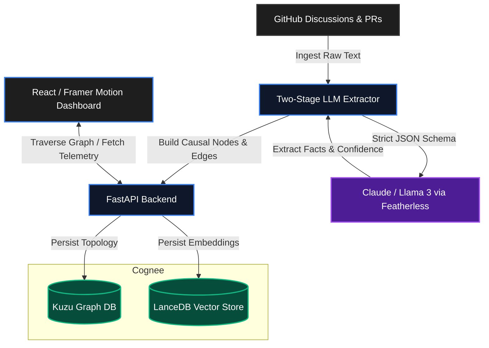

<div align="center">
  
  <h1>Engineering Decision Intelligence (EDI)</h1>
  <p><em>Software teams write code. They lose the reasoning. We remember it.</em></p>
  <br>
  <h4><em>Similarity tells you what looks alike.<br>Causality tells you what repeatedly produced a specific outcome.</em></h4>
</div>

<p align="center">
  
</p>

---

## 🚨 The Problem

Six months after an engineering decision is made, teams ask:

- Why did we choose MongoDB?
- Why was Kubernetes introduced?
- Why was this architecture rejected?
- What happened the last time we made this decision?

GitHub stores code. Documentation becomes stale. Conversations disappear. Institutional memory is lost.

**EDI reconstructs engineering reasoning as a causal memory graph.**

---

## ⚡ Core Thesis

Current AI coding assistants focus on **Semantic Retrieval (RAG)**. They answer: *"What is similar?"*

**Engineering Decision Intelligence (EDI)** focuses on **Causal Retrieval (Graphs)**. It answers: *"What caused what?"*

When a team makes a technical decision, the context, trade-offs, and downstream regrets are buried in GitHub issues, pull requests, and scattered discussions. EDI automatically extracts this institutional memory, structuring it into a continuous knowledge graph of causality.

---

## 🧠 How EDI Thinks

At the core of EDI is the causal topology of technical decisions:



When a user submits a query, EDI follows this structured logic:

`Query` ➔ `Problem Matching` ➔ `Graph Traversal` ➔ `Outcome Analysis` ➔ `Lesson Extraction` ➔ `Confidence Scoring`

---

## ❌ Why Existing AI Fails

Traditional RAG systems retrieve similar text.

If asked: *"What decisions repeatedly caused operational problems?"*
A vector database returns:
- Similar discussions
- Similar issues
- Similar embeddings

EDI traverses: `Problem` ➔ `Decision` ➔ `Outcome` ➔ `Lesson`
allowing it to answer: **"What repeatedly caused this outcome?"**

---

## 🕸️ Why Graphs?

A vector database answers:
*"What discussions are similar?"*

A graph answers:
*"What decisions repeatedly led to this outcome?"*

EDI relies on graph topology because relationships—not documents—contain engineering memory. Without causality, regret and recurrence analysis are impossible.

---

## 🔍 Example Query

**Input:**
> Small team. Rapidly changing schema. MongoDB or PostgreSQL?

**Output:**
> **14 projects** encountered this problem.
> 
> **MongoDB:** 6 reversals.
> **PostgreSQL:** 7 stable outcomes.
> 
> **Strongest signal:** Small teams prioritized operational simplicity over schema flexibility.

---

## 🏗️ Architecture

EDI is built for high reliability and mathematical rigor.



---

## ⚙️ Powered by Cognee

EDI uses [Cognee](https://github.com/topoteretes/cognee) as its foundational memory layer.

Cognee serves as the memory engine enabling causal traversal and persistent engineering memory.

Cognee enables:
- persistent engineering memory
- hybrid graph/vector retrieval
- memory improvement
- causal traversal
- cross-session reasoning

Without Cognee, EDI would require manually building graph storage, vector retrieval, memory orchestration, and relationship traversal algorithms from scratch. It is the engine enabling causal memory and retrieval.

---

## 🎯 Confidence Formula

We don't trust LLM hallucinated confidence. Our system relies on verifiable topology to compute certainty:

- **40%** Evidence Density
- **30%** Recurrence Topology
- **30%** Extraction Certainty

---

## ✨ Features

- 🕸️ **Causal Knowledge Graph:** Understands that a "Microservices Migration" (Decision) led to "High Operational Overhead" (Outcome), leading to "Reverted to Monolith" (Regret).
- 🔄 **Regret Analysis:** Automatically identifies technical decisions that were historically reverted or caused downstream pain across multiple repositories.
- 📡 **Live System Telemetry:** Real-time visibility into graph density, extraction confidence metrics, and institutional knowledge growth.
- 🛡️ **Transparent Fallbacks:** Backend-driven graceful degradation. If inference degrades, the API transparently serves cached structural evidence to the UI.

---

## 🛠️ Tech Stack

<div align="center">
  
  
  
  
  
  
  
  
</div>

---

## 🚀 Getting Started

### 1. Backend Setup

```bash
cd edi
python -m venv venv
source venv/bin/activate  # On Windows: venv\Scripts\activate
pip install -r requirements.txt
```

Create a `.env` file in the `edi/` directory:
```env
GITHUB_TOKEN=your_github_token
OPENAI_API_KEY=your_featherless_or_openai_key
OPENAI_BASE_URL=https://api.featherless.ai/v1
LLM_MODEL=meta-llama/Meta-Llama-3-70B-Instruct
```

Start the FastAPI server:
```bash
uvicorn main:app --reload --port 8000
```
*The API will run on `http://localhost:8000`.*

### 2. Frontend Setup

```bash
cd frontend
npm install
npm run dev
```
*The dashboard will be available at `http://localhost:5173`.*

---

## 🛡️ Defensibility & Security

- **Prompt Injection Defense:** Strict separation of context and instruction. Untrusted GitHub Markdown is explicitly isolated, and all LLM schemas demand strict engineering facts rather than instruction following.
- **Graceful Degradation:** A complete decoupled architecture where the frontend experiences graceful degradation by falling back to cached topological analysis if inference fails, avoiding demo-breaking 503s.

---

## 🔮 Future Work

- Distributed ingestion queues
- Redis-backed cache
- Cross-organization memory
- Graph-based recommendation engine
- Organizational decision analytics

<div align="center">
  <br>
  <sub>Built for the future of Engineering Intelligence.</sub>
</div>
