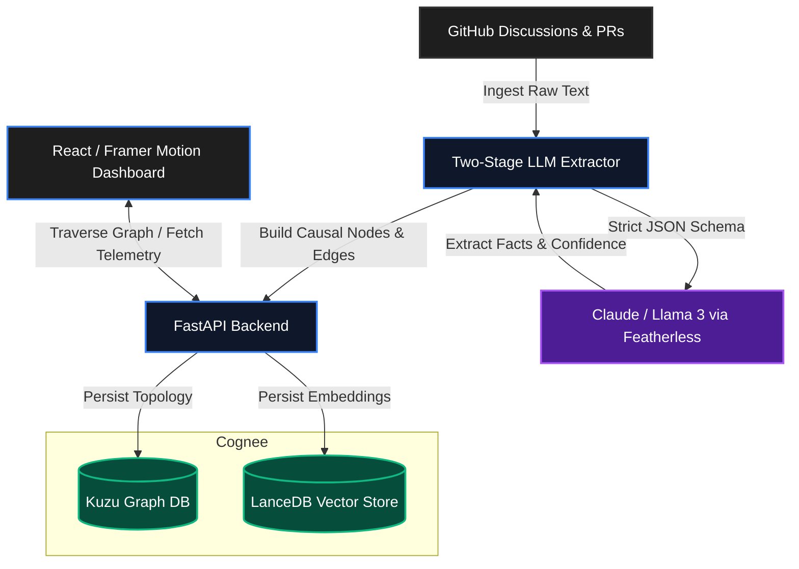

<div align="center">
  
  <h1>Engineering Decision Intelligence (EDI)</h1>
  <p><em>Software teams write code. They lose the reasoning. We remember it.</em></p>
</div>

<p align="center">
  <a href="#core-thesis">Core Thesis</a> •
  <a href="#architecture">Architecture</a> •
  <a href="#features">Features</a> •
  <a href="#tech-stack">Tech Stack</a> •
  <a href="#getting-started">Getting Started</a>
</p>

---

## ⚡ Core Thesis

Current AI coding assistants focus on **Semantic Retrieval (RAG)**. They answer: *"What is similar?"*

**Engineering Decision Intelligence (EDI)** focuses on **Causal Retrieval (Graphs)**. It answers: *"What caused what?"*

When a team makes a technical decision, the context, trade-offs, and downstream regrets are buried in GitHub issues, pull requests, and scattered discussions. EDI automatically extracts this institutional memory, structuring it into a continuous knowledge graph of causality:

`Problem` ➔ `Decision` ➔ `Outcome` ➔ `Lesson`

---

## 🏗️ Architecture

EDI is built for high reliability and mathematical rigor.



### The Confidence Formula
We don't trust LLM hallucinated confidence. Our system relies on verifiable topology to compute certainty:
**`Composite Confidence = 0.4(Evidence Density) + 0.3(Recurrence Topology) + 0.3(Extraction Certainty)`**

---

## ✨ Features

- 🕸️ **Causal Knowledge Graph:** Understands that a "Microservices Migration" (Decision) led to "High Operational Overhead" (Outcome), leading to "Reverted to Monolith" (Regret).
- 🔄 **Regret Analysis:** Automatically identifies technical decisions that were historically reverted or caused downstream pain across multiple repositories.
- 📡 **Live System Telemetry:** Real-time visibility into graph density, extraction confidence metrics, and institutional knowledge growth.
- 🛡️ **Transparent Fallbacks:** Backend-driven graceful degradation. If inference degrades, the API transparently serves cached structural evidence to the UI.
- 🎯 **Mathematical Confidence:** Computes confidence mathematically using evidence density and cross-repository topological recurrence.

---

## 🛠️ Tech Stack

<div align="center">
  
  
  
  
  
  
  
  
</div>

---

## 🚀 Getting Started

### 1. Backend Setup

```bash
cd edi
python -m venv venv
source venv/bin/activate  # On Windows: venv\Scripts\activate
pip install -r requirements.txt
```

Create a `.env` file in the `edi/` directory:
```env
GITHUB_TOKEN=your_github_token
OPENAI_API_KEY=your_featherless_or_openai_key
OPENAI_BASE_URL=https://api.featherless.ai/v1
LLM_MODEL=meta-llama/Meta-Llama-3-70B-Instruct
```

Start the FastAPI server:
```bash
python main.py
```
*The API will run on `http://localhost:8000`.*

### 2. Frontend Setup

```bash
cd frontend
npm install
npm run dev
```
*The dashboard will be available at `http://localhost:5173`.*

---

## 🛡️ Defensibility & Security

- **Prompt Injection Defense:** Strict separation of context and instruction. Untrusted GitHub Markdown is explicitly isolated, and all LLM schemas demand strict engineering facts rather than instruction following.
- **Graceful Degradation:** A complete decoupled architecture where frontend telemetry degrades to cached topological analysis if inference fails, avoiding demo-breaking 503s.

<div align="center">
  <sub>Built for the future of Engineering Intelligence.</sub>
</div>
